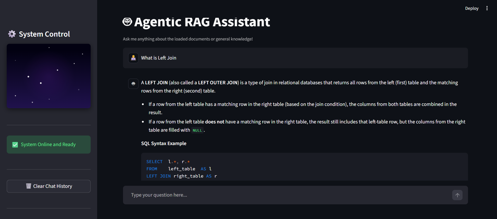
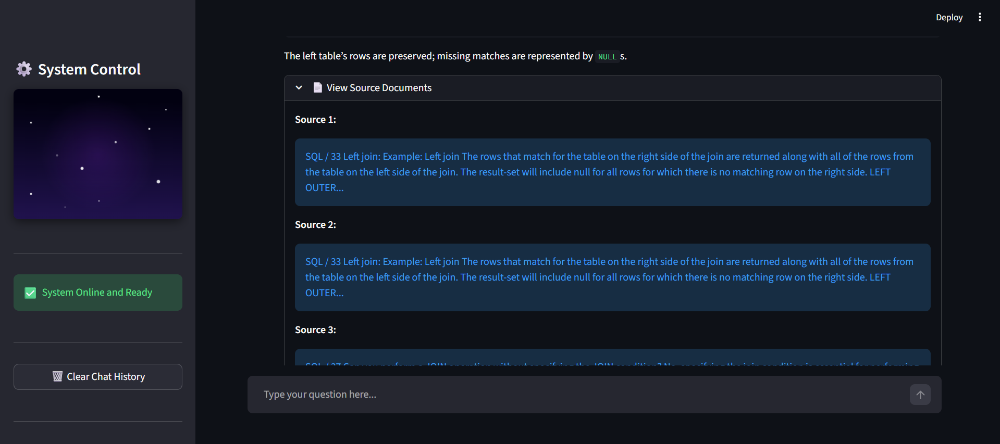

# 🤖 SQL Document & URL Chatbot 🚀

Welcome to the **SQL Document & URL Chatbot**! This project is an intelligent, conversational AI assistant designed specifically to help users learn, query, and troubleshoot SQL concepts. By utilizing Retrieval-Augmented Generation (RAG), the bot ingests custom SQL PDFs, tutorials, and web URLs to provide highly accurate, source-backed answers to your database queries.

✨ **Key Features:**
*   **Multi-Source Ingestion**: Seamlessly processes both local PDF documents and live URLs containing SQL documentation.
*   **Conversational Memory**: A sleek chat interface that remembers the context of your ongoing database discussions.
*   **Source Transparency**: Never guess where an answer came from. View the exact document chunks and links used to generate the response.
*   **Modern UI**: Beautiful dark mode interface with a custom starry night CSS animation and a dedicated system control sidebar.

---

## 🛠️ Tech Stack

This project is built using a modern, fast, and open-source AI stack:

*   **UI Framework**: Streamlit
*   **Orchestration**: LangGraph & LangChain
*   **Vector Store**: FAISS (Local CPU)
*   **Embeddings**: HuggingFace (`sentence-transformers`)
*   **LLM Provider**: OpenRouter (using free open-source models)
*   **Package Manager**: `uv` (for lightning-fast dependency resolution)

---

## 💡 How It Works & Output

Once the system initializes and vectorizes your SQL PDFs and URLs, you will be greeted by the Modern Chat UI.

### 🎯 Accurate, Context-Aware SQL Answers
Ask complex database questions (e.g., *"What is a Left Join?"*). The LangGraph React Agent will process the query, retrieve relevant data from your embedded SQL documents, and format a clean, readable Markdown response complete with syntax examples!

### 📄 Transparent Sourcing
No black-box answers here! Every time the bot answers a SQL question, you can click the **"View Source Documents"** expander to see the exact text chunks and document metadata it pulled from your PDFs or URLs to construct the response. 

---

## 🤝 Contributing
Contributions, issues, and feature requests are welcome! Feel free to check the issues page if you want to add support for more document types or different SQL dialects.

## 📝 License
This project is open-source and available under the [MIT License](LICENSE).
